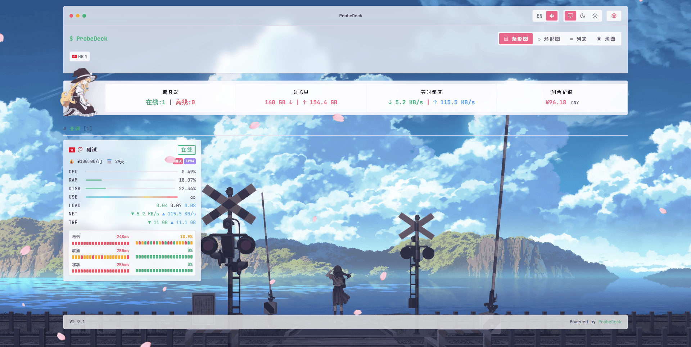
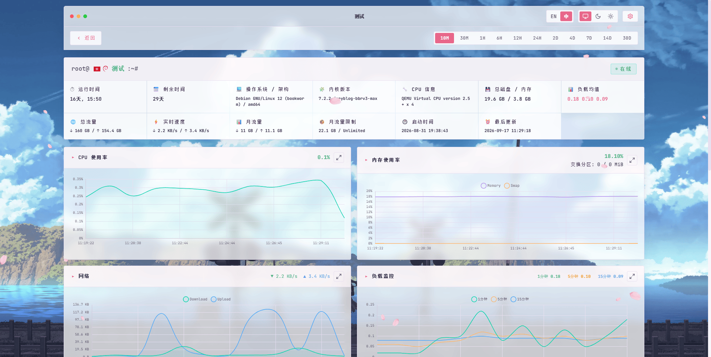
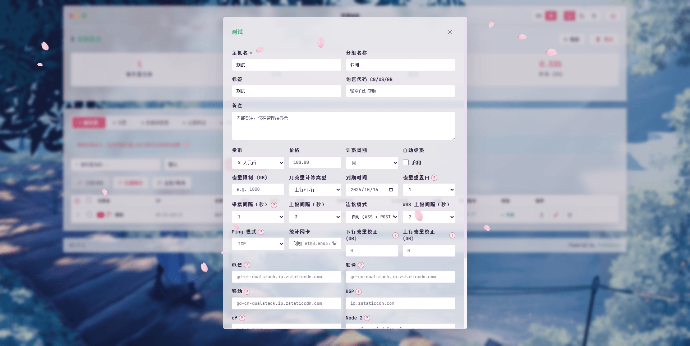
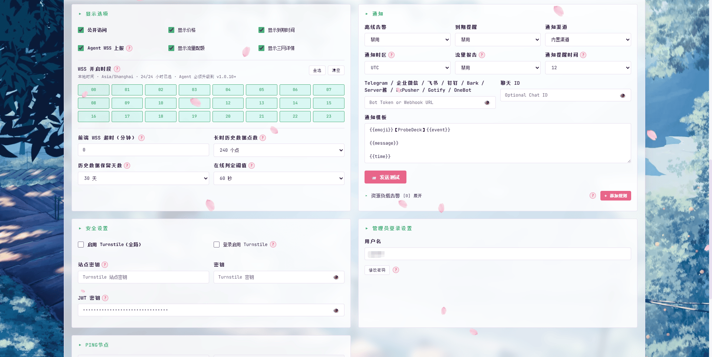

<div align="center">

# ProbeDeck · 探针台

[](https://github.com/gg949/ProbeDeck/releases)
[](LICENSE)
[](https://github.com/gg949/ProbeDeck/actions)
[](https://github.com/gg949/ProbeDeck/stargazers)
[](https://github.com/gg949/ProbeDeck/pkgs/container/probedeck)

**把探针面板搬进你自己的 Docker** — 单容器部署 · 数据全本地 · 上报最低 1 秒 · 1C1G 就能跑

[🔗 在线演示](https://probedeck.guoba.cc.cd/) · [🚀 快速开始](#快速开始) · [💾 数据备份与迁移](#数据与备份) · [🐳 探针 Docker 部署](#用-docker-部署探针unraid--群晖--1panel) · [🔄 从 CF 迁移](#从-cloudflare-原版迁移数据) · [🎨 主题开发](theme-develop.md) · [📖 API 文档](API.md) · [☕ 支持项目](#支持项目)

**[English](README.en.md) | 中文**

</div>

---

**ProbeDeck** 是 [CF-Server-Monitor](https://github.com/huilang-me/CF-Server-Monitor) 的 **Docker / VPS 移植版**。

原版运行在 Cloudflare Workers + D1 + Durable Objects 上；本移植版把整个后端搬进一个
**Node.js 单进程**（better-sqlite3 + ws），**前端、REST API、探针脚本与原版完全一致**，
被控端探针无需任何改动，主题生态完全通用。

> 适配层原理：`server/` 目录在 Node 里模拟了 Workers 的运行时环境
> （D1→SQLite、Durable Objects→单进程实例、Cron→定时器、Workers Assets→静态文件），
> `src/` 业务代码保持原样，方便跟随上游更新。

## 📸 界面预览

**实时监控总览**



**单机详情与实时图表**



**主题商店（兼容原版全部主题）**


<details>
<summary>🖼️ 展开更多截图（服务器编辑面板 / 系统设置）</summary>

**编辑服务器（采集/上报间隔、计费设置、三网节点）**



**系统设置（通知渠道、WSS 上报时段、安全选项）**



</details>

## ✨ 特性

- **🚀 一条命令部署** — 单容器跑起全部服务；`API_SECRET` 首次启动自动生成，零配置开箱即用
- **🪶 极致轻量** — 面板 ~50-75MB 内存、探针仅 ~8MB（CPU 均值 <0.1%），1C1G 小鸡也能长期跑
- **⚡ 秒级监控** — 上报间隔最低 **1 秒**，WSS 长连接实时推送；探针支持 Linux / Alpine / OpenWrt / macOS / 群晖 / fnOS / Windows，**也支持 Docker / Unraid 部署**
- **🔒 数据全本地** — SQLite 全量落盘，无云依赖、无额度限制；备份 = 复制一个目录
- **🛡️ 安全架构** — 探针纯单向上报、零入站端口、不接收任何服务器指令；面板被攻破也碰不到你的被控机器
- **🔔 通知渠道齐全** — Telegram / 企业微信 / 飞书 / 钉钉 / Bark / Server酱 / WxPusher / Gotify / OneBot / 自定义 Webhook
- **🧩 通知增强** — 离线 / 恢复 / 到期 / 资源告警 / 流量 / 测试六类事件的 Emoji 均可自定义；支持粘贴 JavaScript 通知脚本（`sendMessage` / `sendEvent` 约定），任意推送服务都能对接
- **📊 流量报告** — 日报 / 周报 / 月报可分别勾选订阅（全部取消即关闭）；按通知时区定时推送，周报逢周一、月报逢每月 1 号；首次启用或中断后自动从历史数据回补周期数据
- **🎨 主题生态** — 兼容原版 CFSM 全部主题（主题商店一键安装），面板后台还支持自定义 CSS / JS / 背景图
- **🔄 CF 一键迁移** — 面板内置「从 Cloudflare 迁移」：D1 全量数据搬迁（服务器、历史、设置、密码无损）
- **🌍 地区自动识别** — 内置 MaxMind GeoLite2 离线库，探针位置自动显示国旗

> 与原版功能完全一致：实时监控、WebSocket 秒级推送、历史数据与图表、离线告警、到期提醒、流量报告、
> 三网延迟/丢包、地图展示、深色模式、中英文、探针自动更新、数据备份导入导出等。

## 快速开始

### 第 0 步：安装 Docker（已装可跳过）

```bash
curl -fsSL https://get.docker.com | bash
```

> Docker 官方一键安装脚本，支持 Ubuntu / Debian / CentOS / Rocky 等主流系统。
> 装好后执行 `docker --version` 验证；国内服务器拉取镜像慢的话，可自行配置镜像加速器。
>
> **镜像架构**：预构建镜像同时提供 `linux/amd64` 与 `linux/arm64` —— ARM 服务器 / NAS / 树莓派等直接按下面方式拉取即可，Docker 会自动匹配架构。

### 方式一：docker compose 部署（推荐）

**1. 新建 `docker-compose.yml`**，把下面内容整段复制进去（不用下载任何其他文件）：

```yaml
services:
  probedeck:
    image: ghcr.io/gg949/probedeck:latest
    container_name: probedeck
    restart: unless-stopped
    ports:
      # 左侧是宿主机端口（对外访问用），默认 17986。
      # 换端口：把左边的 17986 改成你想要的数字即可，
      # 或在启动时用环境变量：HOST_PORT=你的端口 docker compose up -d
      - "${HOST_PORT:-17986}:17986"
    environment:
      # API_SECRET 可不设置：首次启动自动生成（写入 data/api_secret.txt 并打印在日志里），
      # 如需自定义（比如从旧部署迁移探针）再取消下面这行的注释并填写。
      # API_SECRET: "改成你自己的密钥"

      # 地区自动识别：maxmind（默认，本地 GeoLite2 数据库）/ ipinfo（在线）/ off（关闭）
      GEOIP_PROVIDER: "maxmind"
    volumes:
      # 数据目录：项目专属 /opt/probedeck/data（自动创建）
      # 数据集中一处，更新/备份/卸载都省事；想换位置把左边路径改掉即可
      - /opt/probedeck/data:/app/data
```

**2. 启动：**

```bash
docker compose up -d
```

**3. 以后升级版本：**

```bash
docker compose pull && docker compose up -d
```

### 方式二：一行命令（docker run）

```bash
docker run -d --name probedeck --restart unless-stopped -p 17986:17986 -v /opt/probedeck/data:/app/data ghcr.io/gg949/probedeck:latest
```

> `17986:17986` 左边是宿主机端口，换端口改左边的数字即可；
> `/opt/probedeck/data` 是**项目专属数据目录**（自动创建）——数据集中一处：
> 更新时换任何目录执行都不会挂错、备份只打包这一个目录、卸载删它即清净。
> 想放别的位置就把左边路径换掉（比如 `-v ./data:/app/data` 存到当前目录）。

**以后升级版本**（任何目录执行都行）：

```bash
docker pull ghcr.io/gg949/probedeck:latest && docker stop probedeck && docker rm probedeck && docker run -d --name probedeck --restart unless-stopped -p 17986:17986 -v /opt/probedeck/data:/app/data ghcr.io/gg949/probedeck:latest
```

> 数据都在 `/opt/probedeck/data` 里，删容器不影响；挂载用的是完整路径，**任何目录执行都不会挂错**。

### 启动后访问

- 监控面板：`http://你的服务器IP:端口/`（默认 17986，改过端口就用你自己的）
- 管理面板：`http://你的服务器IP:端口/admin`
  - 用户名：`admin`
  - 初始密码：**首次启动时自动生成**，保存在数据目录的 `api_secret.txt` 里，直接查看：
    ```bash
    # docker run 部署（方式二）：
    cat /opt/probedeck/data/api_secret.txt

    # docker compose 部署（方式一，在 docker-compose.yml 所在目录执行）：
    cat data/api_secret.txt

    # 或从容器里读（两种方式通用）：
    docker exec probedeck cat /app/data/api_secret.txt
    ```
  - （首次启动时日志里也会打印一次；登录后可在面板里修改密码——修改后本文件的值仅用于探针上报，不再作为登录密码）

> 想自定义密钥（比如从旧部署迁移探针）？
> - docker compose 部署：在 `docker-compose.yml` 里加 `API_SECRET: "你的密钥"`
> - docker run 部署：在命令里加 `-e API_SECRET=你的密钥`
>
> 优先级高于自动生成。

### 想从源码构建？（可选）

镜像已由本仓库通过 GitHub Actions 自动构建发布到 `ghcr.io/gg949/probedeck`，**普通部署不需要源码**。想自己构建或用最新未发布的代码：

```bash
git clone https://github.com/gg949/ProbeDeck.git && cd ProbeDeck
docker compose -f docker-compose.build.yml up -d --build
```

### 添加探针（与原版完全一致）

1. 进入管理面板 → 服务器 → 添加服务器
2. 点击该服务器的「安装命令」，复制生成的命令
3. 到被控机器上以 root 执行即可

> 安装命令里的地址取自你访问面板时的地址。建议先配好 HTTPS 反代（见下节）再用域名访问，
> 探针就会通过 HTTPS 上报；直接用 `http://IP:17986` 也可以，但密钥会明文传输。

#### 用 Docker 部署探针（Unraid / 群晖 / 1Panel）

点击「安装命令」后，**目标系统**下拉里选 **Docker / Unraid**，命令框会直接生成可用的 `docker run` 命令（自动带上该服务器的 ID 与密钥），复制执行即可：

```bash
docker run -d \
  --name cf-probe \
  --restart unless-stopped \
  -e SERVER_ID=<服务器ID> \
  -e SECRET=<服务器密钥> \
  -e WORKER_URL=https://<面板地址>/update \
  -v /opt/cf-probe:/etc/cf-probe \
  ghcr.io/gg949/cfsm-agent:latest
```

镜像支持 amd64 / arm64。要点：

- `/etc/cf-probe` **必须挂卷**（存放配置与流量计数），路径固定、内容持久化
- 默认 bridge 网络下只统计容器自己的虚拟网卡，**要监控宿主机真实流量请加 `--network host`**
- 容器内已禁用自动更新，升级方式 = 重新拉镜像重建容器
- 卸载：管理面板「删除服务器」弹窗的目标系统选 **Docker / Unraid**，复制命令执行；或手动 `docker stop cf-probe && docker rm cf-probe`（可选再删镜像和 `/opt/cf-probe`）
- Unraid 用户可给容器配图标：Docker 页 → 点容器 → **Icon URL** 填
  `https://raw.githubusercontent.com/gg949/cfsm-agent/main/docker/icon.png`

探针的完整 Docker 文档见 [cfsm-agent/docker.md](https://github.com/gg949/cfsm-agent/blob/main/docker.md)。

## 反向代理教程

### 方案一：Cloudflare 隧道（无需公网 IP、无需开端口、自带 HTTPS）

**① 先在 Cloudflare Zero Trust 控制台创建隧道**（Networks → Tunnels → Create a tunnel）：
创建过程中把 **Public Hostname** 填成 `你的域名` → `http://localhost:17986`，最后复制页面生成的 **token**（`ey` 开头的一长串）。

**② 在服务器复制执行这一行**（把 `<token>` 换成你复制的那串）：

```bash
cloudflared service install <token>
```

完成——访问你的域名即可，HTTPS 证书与 WebSocket 全自动。

<details>
<summary>cloudflared 尚未安装？点此处展开（安装后再执行上面那行）</summary>

```bash
curl -L -o /usr/local/bin/cloudflared https://github.com/cloudflare/cloudflared/releases/latest/download/cloudflared-linux-amd64 && chmod +x /usr/local/bin/cloudflared
```

ARM 服务器把 `amd64` 换成 `arm64`。Debian/Ubuntu 也可用官方 apt 源安装。
</details>

### 方案二：Caddy（自动申请证书，一行搞定）

**尚未安装 Caddy？** Debian / Ubuntu 先执行（安装包自带开机自启）：

```bash
sudo apt install -y debian-keyring debian-archive-keyring apt-transport-https
curl -1sLf 'https://dl.cloudsmith.io/public/caddy/stable/gpg.key' | sudo gpg --dearmor -o /usr/share/keyrings/caddy-stable-archive-keyring.gpg
curl -1sLf 'https://dl.cloudsmith.io/public/caddy/stable/debian.deb.txt' | sudo tee /etc/apt/sources.list.d/caddy-stable.list
sudo apt update && sudo apt install -y caddy
```

装完 Caddy 会自动启动并设为开机自启（不放心可执行一次 `sudo systemctl enable --now caddy` 确认）。

然后二选一：

**方式 A（临时试一下）**——前台运行，Ctrl+C 即停：

```bash
caddy reverse-proxy --from monitor.example.com --to 127.0.0.1:17986
```

**方式 B（推荐，持久化 + 自启）**——写入 Caddyfile 后重启服务：

```
monitor.example.com {
    reverse_proxy 127.0.0.1:17986
}
```

> 写入 `/etc/caddy/Caddyfile` 后执行 `sudo systemctl restart caddy`。

Caddy 会自动申请并续期 HTTPS 证书，WebSocket 自动透传，无需额外配置。

> ⚠️ 示例里的 `monitor.example.com` 要**换成你自己的域名**再执行。

### 方案三：Nginx（Nginx-X 一键反代）

使用作者维护的 [Nginx-X](https://github.com/gg949/Nginx-X) 自动化脚本配置反代（脚本会自动安装/升级 Nginx、生成代理配置并热加载，每次改动前先执行 `nginx -t` 校验、失败自动回滚，还支持一键 HTTPS 证书）：

```bash
bash -c "$(curl -fsSL https://raw.githubusercontent.com/gg949/Nginx-X/main/install.sh)"
```

安装完成后运行 `nx` → 「配置管理 → 内部反代」，按提示填写**你的域名**和**后端端口 `17986`** 即可。需要 HTTPS 时走「证书管理」一键申请（支持 HTTP-01 / DNS-01），并可自动切换 80 → 443。

## 地区自动识别（GeoIP）

原版在 Cloudflare 上能自动识别探针位置（显示国家/国旗）。本移植版用同样的机制复刻：

| 模式 | 说明 | 启用方式 |
| --- | --- | --- |
| **maxmind**（默认） | 本地 GeoLite2-Country 数据库离线查询 | 默认启用，镜像内置数据库，无需联网 |
| ipinfo | ipinfo.io 在线查询（探针 IP 固定，实际请求量极小） | `GEOIP_PROVIDER=ipinfo`（可配 `IPINFO_TOKEN` 提高额度） |
| off | 关闭，地区留空（可在管理面板手动设置） | `GEOIP_PROVIDER=off` |

**自定义 IP 数据库**：把任意 GeoLite2 格式的 `.mmdb` 文件挂载进容器，然后两种方式任选——

- 放到 `/opt/probedeck/data/geoip/GeoLite2-Country.mmdb`（推荐，自动识别）
- 或设置 `GEOIP_MMDB_PATH=/app/data/geoip/你的文件.mmdb`

数据库文件查找顺序：`GEOIP_MMDB_PATH` → `data/geoip/GeoLite2-Country.mmdb` → 镜像内置；
都找不到时自动从公共镜像源下载（失败则地区功能降级，不影响其他功能）。

> 数据来源：GeoLite2 数据由 [MaxMind](https://www.maxmind.com) 提供（CC BY-SA 4.0），
> 公共镜像源为 P3TERX/GeoLite.mmdb。

**不影响主题**：地区识别的结果写入标准的 `region` 字段（与 CF 版完全相同的字段），
前端和第三方主题读取方式不变，无需任何适配。

## 上报间隔与实时性

- **HTTP 模式**（默认）：探针每隔一段时间上报一次；本移植版已解除原版的 Cloudflare 限制，最小可设 **1 秒**（管理面板 → 编辑服务器 → 上报间隔，可选 1 / 3 / 5 / 10 / 15 / 20 / 30 / 60 / 120 / 180 秒）。
- **WSS 模式**（准实时）：设置里开启「Agent WSS 上报」并勾选全部时段后，探针与面板保持 WebSocket 长连接，数据最快 **1 秒**推送一次（编辑服务器 → WSS 上报间隔）。原版因 Cloudflare 额度限制做了时段选择，VPS 部署无此限制，**24 小时全开即可**。
- **离线判定阈值**：面板默认超过 **300 秒**没收到上报才判定离线（防止网络抖动误报），可在 管理面板 → 设置 → 显示选项 → 「离线判定阈值」调整（60 秒 ~ 3600 秒）。探针卸载/停机后，在阈值时长内仍会显示"在线"属正常现象。

## 通知与流量报告

通知在「管理面板 → 设置 → 通知」中配置，全部本地计算、无云依赖：

- **通知方式**：内置渠道（Telegram / 企业微信 / 飞书 / 钉钉 / Bark / Server酱 / WxPusher / Gotify / OneBot），或「自定义 Webhook」（填 URL + 请求体模板，`{{变量}}` 自动替换）；也可以直接粘贴 **JavaScript 通知脚本**对接任意推送服务（约定 `sendMessage(message, title)` / 可选 `sendEvent(event)`，服务端沙箱执行）。JS 脚本非空时优先级最高、接管全部通知。
- **事件 Emoji**：离线 / 恢复 / 到期 / 资源告警 / 流量 / 测试六类事件的 Emoji 均可自定义。
- **服务器范围**：离线告警、到期提醒、流量报告均支持只包含选定的服务器（留空 = 全部服务器），适合只想盯部分机器的场景。
- **流量报告**：勾选要接收的报告类型——**日报**（每天）/ **周报**（每周一）/ **月报**（每月 1 号），全部取消即关闭；报告在「通知时区」下的「通知提醒时间」发送。报告基于网卡累计计数统计，服务器或探针重启可能导致计数归零、影响当期数据准确性。首次启用或报告中断后的周期会自动从历史数据回补起点读数；历史覆盖不足完整周期时，报告会标注数据起始日期（如「（自 09/28 起）」）。
- 开启报告需要至少配置一种可用的通知方式；配置完成后点「发送测试」即可验证通道。

## 环境变量

全部可选——不配置任何变量即可启动。

| 变量 | 说明 | 默认 |
| --- | --- | --- |
| `API_SECRET` | 探针上报密钥 + 管理面板初始密码。不设置则首次启动自动生成 | 自动生成 |
| `PORT` | 容器内监听端口 | `17986` |
| `API_USER_NAME` | 管理面板用户名 | `admin` |
| `HISTORY_RETENTION_DAYS` | 历史数据保留天数（也可以在面板里直接设置，面板优先） | `14` |
| `GEOIP_PROVIDER` | 地区识别：`maxmind` / `ipinfo` / `off` | `maxmind` |
| `GEOIP_MMDB_PATH` | 自定义 GeoLite2 数据库路径 | 空 |
| `IPINFO_TOKEN` | ipinfo.io token（可选） | 空 |
| `CORS_ALLOWED_ORIGINS` | 允许跨域的来源，逗号分隔（一般同域部署不需要） | 空 |
| `DEBUG` | 设为 `1` 输出调试日志 | 空 |
| `DATA_DIR` | 数据目录 | `/app/data` |

## 数据与备份

| 文件 | 说明 |
| --- | --- |
| `/opt/probedeck/data/monitor.db` | 主数据库（SQLite：服务器、历史、设置） |
| `/opt/probedeck/data/api_secret.txt` | 自动生成的密钥 |
| `/opt/probedeck/data/geoip/` | 自动下载的 GeoIP 数据库（如使用） |
| `/opt/probedeck/data/do-storage.json` | 实时广播模块的少量运行状态 |

数据全部在这一个目录里，**备份 = 复制这个目录，迁移 = 把它放到另一台机器**。
不需要在面板里做任何导入导出——Docker 部署下直接操作文件就是最简单的方式。

### 备份

**在线备份（推荐，不用停服务）**——SQLite 的 `.backup` 导出的是一致快照，
不影响正在写入的面板。镜像里没有 sqlite3 命令行，所以在**宿主机**上执行
（需要先装：`apt install -y sqlite3`）：

```bash
# 在 VPS 上执行：容器内备份 → 复制到宿主机 → 清理临时文件
docker cp probedeck:/app/data/monitor.db /tmp/monitor-live.db
docker cp probedeck:/app/data/monitor.db-wal /tmp/monitor-live.db-wal 2>/dev/null || true
sqlite3 /tmp/monitor-live.db ".backup '/tmp/probedeck-$(date +%Y%m%d).db'"
gzip -f "/tmp/probedeck-$(date +%Y%m%d).db"
rm -f /tmp/monitor-live.db /tmp/monitor-live.db-wal
```

> 带上 `-wal` 一起复制是关键：WAL 模式下最新数据可能还在 `-wal` 文件里，
> 只复制 `.db` 会丢最近几分钟的数据。`.backup` 会把两者合并成一致快照。

**冷备份（最稳，适合换机迁移）**——先停容器再整目录打包，避免任何文件锁问题：

```bash
docker stop probedeck
tar czf probedeck-data-$(date +%Y%m%d).tar.gz -C /opt probedeck/data
docker start probedeck
```

> 建议至少保留最近 3-7 天的备份，重要节点变动前手动备一次。
> 备份文件含服务器列表和设置（密码是哈希），但**不含**探针本身——探针装在被控机上，
> 面板数据丢了重装探针即可恢复上报。

### 定时自动备份（cron）

把下面这段存成 `/etc/cron.daily/probedeck-backup`（记得 `chmod +x`），
每天自动备份并只保留最近 7 份：

```bash
#!/bin/sh
# 每天在线备份，保留最近 7 份（镜像内无 sqlite3，宿主机需 apt install -y sqlite3）
BACKUP_DIR=/opt/probedeck-backups
mkdir -p "$BACKUP_DIR"
STAMP=$(date +%Y%m%d)
# 先复制出 .db 和 -wal（WAL 里可能有最新数据），再用 .backup 合并成一致快照
docker cp probedeck:/app/data/monitor.db /tmp/pd-live.db
docker cp probedeck:/app/data/monitor.db-wal /tmp/pd-live.db-wal 2>/dev/null || true
sqlite3 /tmp/pd-live.db ".backup '$BACKUP_DIR/probedeck-$STAMP.db'"
rm -f /tmp/pd-live.db /tmp/pd-live.db-wal
gzip -f "$BACKUP_DIR/probedeck-$STAMP.db"
ls -tp "$BACKUP_DIR"/probedeck-*.db.gz | grep -v '/$' | tail -n +8 | xargs -r rm -f
```

> 备份目录放在 `/opt/probedeck/` 外面（如 `/opt/probedeck-backups/`）更稳，
> 这样卸载面板时（`rm -rf /opt/probedeck`）不会顺手带走备份。

### 迁移到另一台 VPS

1. **旧机器**：按上面「冷备份」打包 `probedeck-data-日期.tar.gz`，传到新机器：
   ```bash
   scp probedeck-data-*.tar.gz root@新机器IP:/opt/
   ```
2. **新机器**：装 Docker → 起一个空面板容器（用快速开始的命令即可）→ 停掉它 →
   解压覆盖数据目录 → 再启动：
   ```bash
   docker stop probedeck
   tar xzf /opt/probedeck-data-*.tar.gz -C /opt
   docker start probedeck
   ```
3. 访问新机器的 `http://IP:17986`——服务器、历史、设置、登录密码全部原样。

> **迁移后探针不用重装**：探针只认 `SERVER_ID` + `SECRET`，数据搬过去后
> 把域名/IP 换成新面板地址即可继续上报（改探针的 `WORKER_URL` 后重启探针服务，
> 或在面板上重新生成安装命令重装——两种都行）。
>
> **换域名/IP 但不动数据**：面板地址变了探针会失联，在面板「编辑服务器」里
> 重新复制安装命令到被控机执行即可，历史数据不会丢。

历史数据保留时长**可自定义**，两种方式（面板设置优先）：
1. **面板设置（推荐）**：管理面板 → 设置 → 显示选项 → 「历史数据保留天数」，可选 7 / 14 / 30 / 60 / 90 / 180 / 365 天（选「自动」则使用默认 14 天）；
2. 环境变量 `HISTORY_RETENTION_DAYS=30`（适合批量部署；面板设置为「自动」时生效）。
内部按"轮换周期 = 保留天数的一半"自动清理旧数据，数据库体积保持很小。
未登录访客默认只能查看最近 **24 小时** 的历史；可在管理面板 → 设置 → 显示选项 → 「访客历史范围」中放宽（1 / 2 / 4 / 7 / 14 / 30 天可选，登录管理员不受此限制）。

## 从源码直接运行（不用 Docker）

```bash
npm install
npm run build:frontend
npm start          # 默认 17986 端口；API_SECRET 同样会自动生成
```

要求 Node.js 20+（推荐 22/24）。

## 与 Cloudflare 原版的差异

| 项 | 说明 |
| --- | --- |
| 地区识别 | 已用 GeoIP 复刻（见上节），行为与原版基本一致 |
| CF 用量统计 | 管理面板中的 Cloudflare 额度查询卡片已移除（VPS 部署无此概念） |
| Turnstile 人机验证 | CF 服务，默认关闭（建议保持关闭）；如需启用需服务器能访问 challenges.cloudflare.com |
| 版本更新提示 | 面板里的"检查新版"读取的是本仓库的 version.json（发新版时同步更新它即可提示最新版）；升级方法见「部署」章节中对应你部署方式（compose / docker run）的升级说明 |
| 其他 | 定时任务按 UTC（与原版一致）、周期表轮换（保留时长可自定义）、离线检测、通知渠道逻辑 100% 保留 |

## 从 Cloudflare 原版迁移数据

原版部署在 Cloudflare（Workers + D1）上，数据**可以完整迁移**到本移植版——
D1 本身就是 SQLite，表结构与本项目完全相同：服务器列表、历史数据、流量统计、
面板设置（含登录密码、通知配置、主题设置）会**全部保留**。

### 方式一（推荐）：面板一键迁移，零命令行

ProbeDeck 的「数据库管理」页面内置了「**从 Cloudflare 一键迁移**」：
填入三项信息即可自动把全部数据拉取过来：

- **Cloudflare 账号 ID**：CF 控制台首页右侧栏
- **D1 数据库 ID**：Workers 和 Pages → D1 → 选中你的数据库（UUID 格式）
- **API Token**：My Profile → API Tokens → 创建，权限选 **D1 → 读取** 即可

> 迁移会自动备份现有数据（失败自动还原），Token 仅单次使用、不会被保存。
> 原版面板会在导出期间短暂不可用（几十秒，正常现象）。

### 方式二：手动导出 / 导入（适合想全程自己掌控的用户）

**① 导出 D1 数据**——用**任意一台电脑**操作即可（数据都在 Cloudflare 云端，与你当初用哪台电脑部署的无关；
Windows / Mac / Linux 都行，只要登录你当初部署原版的 Cloudflare 账号）：

```bash
# 没装过 Node.js 的话，先去 https://nodejs.org 下载 LTS 版安装
# 然后打开终端（Windows 用 PowerShell），逐条执行：

npx wrangler login     # 会弹出浏览器，登录你的 Cloudflare 账号
npx wrangler d1 list   # 查看数据库名（原版默认叫 server-monitor-db）
npx wrangler d1 export server-monitor-db --remote --output=backup.sql
```

> 最后一条命令里的 `server-monitor-db` 换成 `d1 list` 里看到的实际数据库名；
> 执行成功后会在当前目录生成 `backup.sql`，把它传到 VPS 继续下一步。

**② 把 backup.sql 传到 VPS，导入到 ProbeDeck**：

```bash
# 安装 sqlite3 命令行工具（没装过的话）
sudo apt install -y sqlite3

# ① 停止面板容器（导入期间必须停止，避免文件锁）——按部署方式选一条：
docker compose down      # compose 部署（在 compose 文件所在目录执行）
docker stop probedeck    # docker run（一行命令）部署

# ② 用导出文件建一个新库（当前库如果已有数据，先改名备份、别删）
mv /opt/probedeck/data/monitor.db /opt/probedeck/data/monitor.db.bak 2>/dev/null
sqlite3 /opt/probedeck/data/monitor.db < backup.sql

# ③ 重新启动——按你的部署方式选一条：
docker compose up -d     # compose 部署
docker start probedeck   # docker run（一行命令）部署
```

**③ 完成**：打开面板，用**原来的密码登录**——改过密码的话原密码直接可用；
从未改过密码的，登录密码 = 你原 CF 版配置的 API_SECRET。

**探针（被控机）怎么处理？** 因为面板地址变了（CF 域名 → 你的新域名），
每台被控机需要更新上报地址——最省事的办法：管理面板里对每台服务器点「安装/更新」，
把生成的命令复制到对应机器上执行一遍即可（1 分钟一台）。**历史数据都在服务端，重装探针不丢数据**。

**想让探针保留原 API_SECRET？** 在 `docker-compose.yml` 里加一行
`API_SECRET: 你原来的密钥` 即可；不设置也没关系（面板自动生成新密钥，重装探针时自动带上）。

## 更新上游

本移植版相对上游只新增了 `server/`（适配层）与 Docker 相关文件，`src/`、`public/`、
`scripts/` 与上游保持一致。同步上游更新时，覆盖这几个目录后推送到本仓库即可——
GitHub Actions 会自动重新构建并发布新镜像；本地从源码构建则执行：

```bash
docker compose -f docker-compose.build.yml up -d --build
```

## 卸载

### 卸载被控端（探针）

在被控机（root）上执行，二选一（效果相同：停止服务，删除探针程序、配置、流量统计和日志）：

**① Go 版探针（面板弹窗默认给的就是这条；需要能访问 GitHub）**：

```bash
curl -fsSL https://raw.githubusercontent.com/gg949/cfsm-agent/main/install.sh | sh -s -- uninstall
```

**② 面板下发脚本（不需要访问 GitHub；也适用于旧版 Shell 探针）**：

```bash
curl -fsSL 'http://你的面板地址/uninstall.sh' | sh -s
```

- ① 全自动执行、不询问；② 会先询问确认，跳过询问：结尾换成 `| sh -s -- -y`
- 支持 systemd / OpenRC / OpenWrt / 群晖 DSM / macOS；Windows 被控机使用 `uninstall.ps1`
- 也可以在管理面板里「删除服务器」——弹窗会按你选择的系统/版本/代理生成对应卸载命令，复制执行一样有效

**③ Docker / Unraid 部署的探针**：

```bash
docker stop cf-probe && docker rm cf-probe
# 可选：docker rmi ghcr.io/gg949/cfsm-agent:latest
# 可选：rm -rf /opt/cf-probe   # 配置和流量计数
```

面板「删除服务器」弹窗的目标系统选 **Docker / Unraid** 会生成同一条命令。

### 卸载主控端（部署 ProbeDeck 的服务器）

**① 停止并删除容器**（按你的部署方式选一条）：

```bash
# docker compose 部署的（在部署目录里执行）：
docker compose down

# docker run（一行命令）部署的：
docker stop probedeck && docker rm probedeck
```

**②（可选）删除镜像**：

```bash
docker rmi ghcr.io/gg949/probedeck:latest
```

**③（可选）删除数据**——⚠️ 面板设置、服务器记录、全部历史数据都在 `/opt/probedeck/data` 里，删了就没了；想保留就先复制一份备份。

```bash
# 数据都在项目专属目录里，整个删掉即可（干净利落）
rm -rf /opt/probedeck
```

> 💡 数据只存在 `/opt/probedeck/data` 里（容器内部没有独立存储）。想卸载得干干净净 = ① 删容器 + ② 删镜像 + ③ `rm -rf /opt/probedeck`，三个都做即彻底清空。

## 常见问题

**Q：页面提示 "Frontend not available / 未构建前端"？**
运行 `npm run build:frontend`（Docker 构建时会自动执行）。

**Q：想换端口？**
- 部署时：**一行命令部署** → 把 `-p 17986:17986` 左侧的 17986 改成你要的端口；**compose 部署** → 改 `docker-compose.yml` 里 `${HOST_PORT:-17986}` 的默认值，或启动时执行 `HOST_PORT=你的端口 docker compose up -d`
- 部署后：**compose 部署** → 改 `docker-compose.yml` 里 `ports` 的左侧数字，然后 `docker compose up -d` 重建容器；**docker run 部署** → 用「方式二」的升级命令重新跑一遍，只把 `-p` 左侧数字换成新端口
- 换完记得同步调整反代（隧道/Caddy/Nginx）的目标端口

**Q：上传了自定义网站图标（favicon）但不生效？**
① 上传图片后要**点页面底部的「保存设置」**才真正保存；② 浏览器对 favicon 的缓存非常顽固——
用 `Ctrl+F5` 强制刷新、或换无痕窗口/换浏览器验证；手机端清一下浏览器缓存再看。

**Q：探针一直显示离线？**
检查：被控机能访问上报地址（`curl 地址/api/config`）、防火墙放行、HTTPS 证书有效、
探针进程在运行（`systemctl status cf-probe`；Docker 部署用 `docker logs cf-probe`）。
另外确认「离线判定阈值」（设置 → 显示选项）——刚装上或刚重启的探针在阈值时长内会显示在线，属正常。

**Q：Docker 部署的探针流量统计偏小？**
默认 bridge 网络下探针只能看到容器自己的虚拟网卡。要统计宿主机真实流量，重建容器时加 `--network host`。

**Q：Docker 部署的探针怎么升级？**
容器内已禁用自动更新。重新拉镜像重建即可：
`docker pull ghcr.io/gg949/cfsm-agent:latest && docker stop cf-probe && docker rm cf-probe`，
然后用原来的 `docker run` 命令重建（环境变量不变，`/etc/cf-probe` 卷里的配置和流量计数保留）。

**Q：地区都显示空白？**
查看启动日志中"地区识别"一行：若显示"已降级"说明数据库未就绪——联网后重启容器会自动下载，
或手动放置 `.mmdb` 到 `/opt/probedeck/data/geoip/`。

## 相关文档

- [主题开发文档](theme-develop.md)：第三方主题开发规范——数据接口、WebSocket 协议、构建产物约定、页脚要求与提交流程
- [全局 API 文档](API.md)：完整 REST / WebSocket API 参考——鉴权、端点、数据结构、错误码

> **主题生态**：ProbeDeck 与原版 CF-Server-Monitor 的主题**完全通用**。面板中可直接填写任意主题链接（不限数量），格式为 `https://github.com/<作者>/<仓库>/tree/<分支>`；也可以在「主题商店」里一键安装（商店列表来自 [gg949/ProbeDeck-themes](https://github.com/gg949/ProbeDeck-themes)，加新主题只改那个仓库，不用发面板版）。即使主题链接失效，站点也会自动回落到内置界面，不受影响。

## 支持项目

如果 ProbeDeck 对你有帮助，欢迎通过以下方式支持后续维护。

<p>
  
</p>

- 微信赞赏：扫码支持

## 致谢与许可

- 原始项目：[huilang-me/CF-Server-Monitor](https://github.com/huilang-me/CF-Server-Monitor)（MIT）
- 原版说明文档保留在 `README-upstream.md`
- 本项目同样以 MIT 协议开源，见 [LICENSE](LICENSE)
